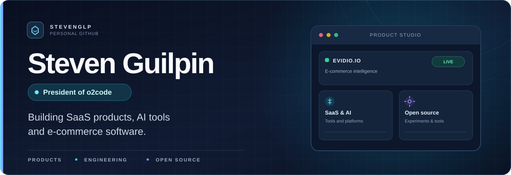

  

  <a href="https://github.com/o2code-org"><strong>o2code</strong></a>
  &nbsp;&nbsp;•&nbsp;&nbsp;
  <a href="https://evidio.io"><strong>Evidio.io</strong></a>
  &nbsp;&nbsp;•&nbsp;&nbsp;
  <a href="https://github.com/StevenGlp?tab=repositories"><strong>Repositories</strong></a>

### Hi, I'm Steven 👋

I'm **Steven Guilpin**, President of **[o2code](https://github.com/o2code-org)**, a digital agency focused on building modern digital products.

I create SaaS platforms, AI-powered tools and software for businesses. I like taking an idea all the way from product strategy and architecture to a real application people can use.

My first live SaaS is **[Evidio.io](https://evidio.io)**, focused on e-commerce and dropshipping intelligence.

### What I'm building

<table>
  <tr>
    <td width="50%" valign="top">
      <h3>🔎 <a href="https://evidio.io">Evidio</a></h3>
      
<strong>Live SaaS</strong>

      
E-commerce and dropshipping intelligence. Tools to research stores, products and competitors.

      <a href="https://evidio.io">Visit Evidio ↗</a>
    </td>
    <td width="50%" valign="top">
      <h3>💠 <a href="https://github.com/o2code-org">o2code</a></h3>
      
<strong>Digital agency</strong>

      
Designing and developing web platforms, software and digital experiences with a focus on solid engineering.

      <a href="https://github.com/o2code-org">Explore o2code ↗</a>
    </td>
  </tr>
  <tr>
    <td width="50%" valign="top">
      <h3>🤖 AI & automation</h3>
      
<strong>Ongoing work</strong>

      
Exploring AI agents, MCP integrations, automation and developer productivity tooling.

    </td>
    <td width="50%" valign="top">
      <h3>🛠️ Open source</h3>
      
<strong>Building & experimenting</strong>

      
Working on developer tools and local-first software, with an interest in transparent, practical infrastructure.

    </td>
  </tr>
</table>

### My stack

  

**Product engineering:** TypeScript, Next.js, React, Node.js, APIs, PostgreSQL, Prisma, Redis

**Systems & infrastructure:** Docker, CI/CD, background jobs, cloud storage, Rust

**Current interests:** SaaS architecture, AI agents, Model Context Protocol (MCP), automation, open-source tools

### How I approach product development

- **Build for real use:** start with the problem, ship a working product, then improve it.
- **Keep the architecture clear:** reliable contracts, maintainability and a single source of truth.
- **Own the whole product:** engineering, UX, infrastructure and the details that make software usable.

### Let's connect

You can follow my work here on GitHub, explore the projects at **[o2code](https://github.com/o2code-org)**, or check out **[Evidio.io](https://evidio.io)**.

  <a href="https://github.com/StevenGlp">GitHub</a>
  &nbsp;&nbsp;•&nbsp;&nbsp;
  <a href="https://github.com/o2code-org">o2code</a>
  &nbsp;&nbsp;•&nbsp;&nbsp;
  <a href="https://evidio.io">Evidio</a>

